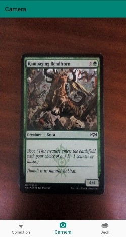

# HeadronVaultP
An android application that is meant to be used with the [DatabaseAPI](https://github.com/mohdarya/DatabaseApiP) project to keep track of user's magic the gathering collection and decks

# Tech/Framework used 
<li>Retrofit   
<li>okhttp3
</li>

# Features

<li>
uses the databaseApi's image recognition functionality to add cards to the users collection 
<li>
show the users the decks that have a card in them 
<li>
shows the colour that the users decks has in them 
</li>

# Sample Screenshot 
Collection Page
 

 
Card Detail Page
 

 
Card selection for deck creation 
 

 
Deck art selection for deck creation 
 

 
Entering deck name for deck creation 
 

 
Deck Page 
 

 
Deck Detail Page 
 

 
Image Recognition camera 
 

 
Image Recognition card confirmation 
 

